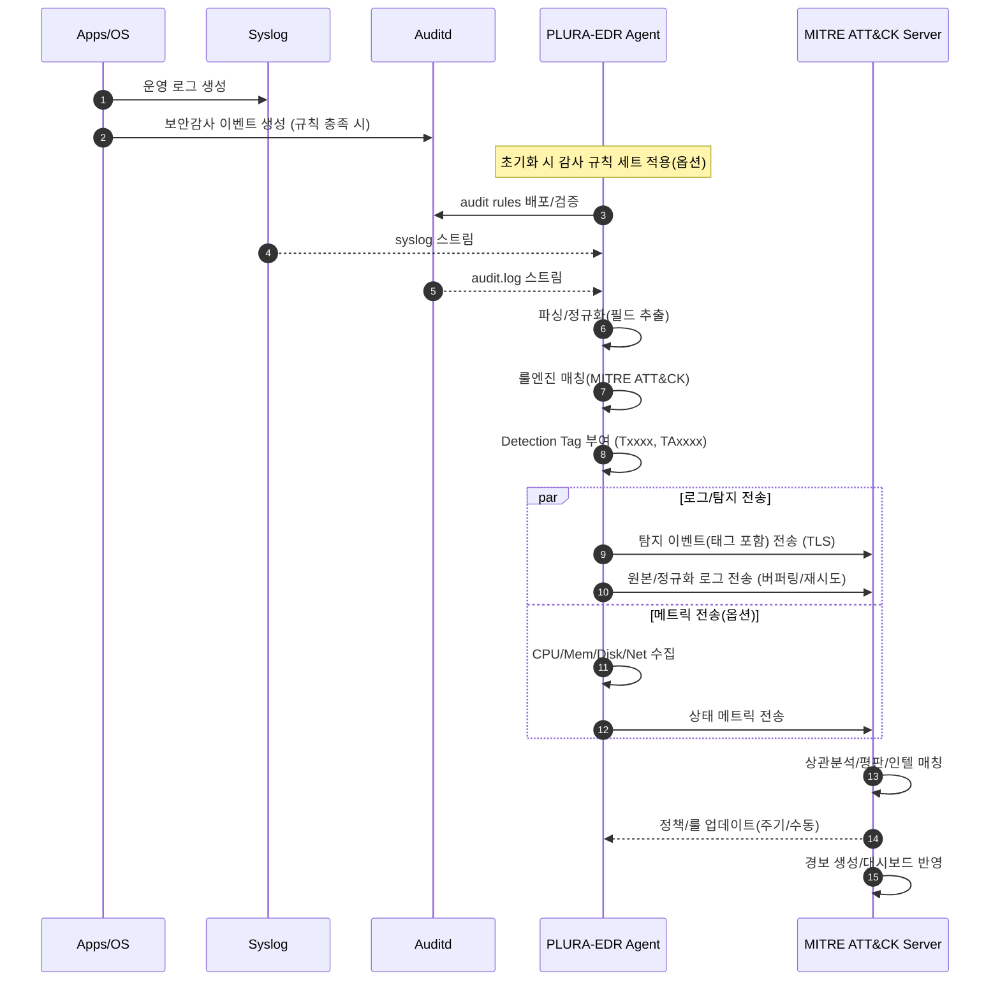

**PLURA-EDR 리눅스 에이전트의 역할**에 대한 소개:

---

# 🐧 PLURA-EDR 리눅스 에이전트 역할 상세 설명

PLURA-EDR의 리눅스 에이전트는 서버·호스트 단에서 발생하는 로그 및 시스템 이벤트를 수집·분석하고, 이를 **MITRE ATT\&CK 기반 탐지 정책**과 연계하여 실시간 위협을 식별하는 핵심 모듈입니다. 주요 역할은 다음과 같이 정리할 수 있습니다.

---

## 1. **기본 로그 수집**

* **syslog 수집**

  * 시스템 전반에서 발생하는 운영 로그(`/var/log/messages`, `/var/log/syslog` 등)를 실시간 수집합니다.
  * 로그인, 프로세스 실행, 네트워크 이벤트, 서비스 동작 등의 정보를 포함합니다.

---

## 2. **Audit 로그 수집**

* **Audit 로그 연계**

  * 시스템에 **auditd**(Linux Audit Framework)가 설치·운영 중인 경우, `audit.log`를 추가 수집합니다.
  * 파일 접근, 권한 변경, 관리자 명령어 실행 등 **보안 감사를 위한 핵심 이벤트**를 포착할 수 있습니다.

---

## 3. **감사 정책 적용**

* **Audit 정책 자동 적용**

  * auditd가 활성화되어 있다면, PLURA-EDR 에이전트는 보안 강화를 위해 필요한 감사 규칙(audit rules)을 자동으로 배포 및 적용합니다.
  * 예: `/etc/audit/rules.d/`에 정책 반영, root 권한 명령어 실행 추적, 주요 파일/디렉토리 접근 모니터링 등.

---

## 4. **MITRE ATT\&CK 기반 실시간 탐지**

* **로그-룰 매칭 분석**

  * 수집된 `syslog` 및 `audit.log` 이벤트를 MITRE ATT\&CK 서버의 탐지 Rule(정책)과 실시간 비교합니다.
  * 해당 이벤트가 공격 기법(Tactic/Technique)에 부합하면 탐지 태그(Detection Tag)를 부여합니다.
  * 예:

    * `T1059 – Command and Scripting Interpreter`
    * `T1070 – Indicator Removal on Host`

---

## 5. **로그 및 탐지 결과 전송**

* **전송 대상: MITRE ATT\&CK 서버**

  * 에이전트는 탐지 이벤트 및 전체 로그를 보안 서버(PLURA-XDR/ATT&CK 서버)로 전송합니다.
  * 서버에서는 이를 기반으로 상관분석, 위협 인텔리전스 매칭, 경보(Alert) 생성 등을 수행합니다.

---

## 6. **시스템 리소스 사용량 모니터링**

* **옵션 기능**

  * 관리자 설정에 따라 CPU, 메모리, 디스크, 네트워크 등의 **시스템 자원 사용량**을 수집합니다.
  * 성능 저하나 비정상 리소스 사용이 탐지될 경우, 이를 함께 보고하여 **위협 징후와 시스템 상태를 연계 분석**할 수 있습니다.

---

# ✅ 정리

즉, **리눅스 에이전트**는 단순 로그 수집기를 넘어:

* **감사 정책 자동 적용**,
* **MITRE ATT\&CK 기반 실시간 위협 탐지**,
* **탐지 태그 부여 및 전송**,
* **시스템 상태 모니터링**

까지 수행하는 **능동적 보안 센서(Active Security Sensor)** 역할을 담당합니다.

---

# PLURA-EDR 리눅스 에이전트 동작 개요

## 1) 기능–데이터 흐름 매핑 표

| 단계              | 에이전트 기능             | 입력/전제                                | 처리                                     | 출력/전송                          |
| --------------- | ------------------- | ------------------------------------ | -------------------------------------- | ------------------------------ |
| ① 로그 수집(syslog) | syslog 실시간 수집       | /var/log/messages, /var/log/syslog 등 | 파서/정규화(호스트, 프로세스, 사용자, 네트워크 필드 추출)     | 표준화 로그 레코드                     |
| ② 로그 수집(audit)  | audit.log 수집(옵션)    | auditd 활성화                           | AUDIT 규격 파싱(UID/EUID, SYSCALL, PATH 등) | 표준화 보안감사 레코드                   |
| ③ 감사 정책 적용      | audit rules 배포(옵션)  | auditd 설치·운영                         | 중요 객체/행위 규칙 셋 적용(파일접근, 특권명령, 설정변경)     | 감사 이벤트 생성률 향상                  |
| ④ 실시간 탐지 태깅     | MITRE ATT\&CK 룰 매칭  | 표준화된 syslog/audit 이벤트                | 룰엔진 매칭 → Tactic/Technique 매핑           | Detection Tag(예: TA0002/T1059) |
| ⑤ 전송            | 탐지·원본 로그 전송         | 안전 채널(예: TLS)                        | 배치/스트리밍 전송(버퍼링, 재시도)                   | MITRE ATT\&CK 서버 수신            |
| ⑥ 리소스 수집(옵션)    | CPU/Mem/Disk/Net 수집 | 에이전트 로컬 수집                           | 임계치/이상징후 보조 분석                         | 상태 메트릭 전송                      |

---

## 2) 블록 다이어그램 (mermaid flowchart)

```mermaid
flowchart LR
  subgraph Host["Linux Host"]
    A[Syslog Sources\n(sshd, sudo, kernel, systemd, apps)]
    B[Auditd\n(/var/log/audit/audit.log)]
    C[System Metrics\n(CPU/Mem/Disk/Net)]
  end

  subgraph Agent["PLURA-EDR Agent"]
    P1[Log Collector\n(syslog tail, journal, file)]
    P2[Audit Collector\n(audit.log)]
    P3[Audit Policy Manager\n(audit rules deploy)]
    N[Normalizer/Parser]
    R[Rule Engine\n(MITRE ATT&CK mapping)]
    T[Tagger\n(Detection Tag 부여)]
    Q[Queue/Buffer\n(Retry, Backoff)]
    X[Metric Collector]
    E[Secure Sender\n(TLS)]
  end

  subgraph Server["MITRE ATT&CK Server / PLURA-XDR"]
    S1[Ingest API]
    S2[Correlation/Threat Intel]
    S3[Alerting & Dashboards]
    S4[Storage/Lake]
  end

  A --> P1 --> N
  B --> P2 --> N
  P3 -.-> B
  N --> R --> T --> Q --> E --> S1 --> S2 --> S3
  C --> X --> Q
  Q --> S4
```

---

## 3) 시퀀스 다이어그램 (mermaid sequenceDiagram)



---

## 4) 탐지 태깅 규칙 구조(예시)

* **룰 키:** `linux_t1059_bash_suspicious`
* **조건:**

  * `event.source == "audit"` AND
  * `syscall in ["execve"]` AND
  * `exe in ["/bin/bash","/usr/bin/bash","/bin/sh"]` AND
  * `cmdline matches /(curl|wget).*(-o|>|>>).*(/tmp|/dev\/shm)/`
* **태그:** `TA0002(Execution)`, `T1059(Command and Scripting Interpreter)`
* **심각도:** `High`
* **출력 필드:** `host, user, exe, cmdline, pid, ppid, ts, detection_tags[]`

---

## 5) 운영 포인트(요약)

* **정책 일관성:** 감사 규칙은 OS 버전/환경별 템플릿화하여 배포(충돌·중복 방지).
* **재시도/백프레셔:** 네트워크 단절 시 로컬 버퍼링, 전송 재시도 전략 필수.
* **성능 가드레일:** 수집·파싱 스레드/큐 크기, 파일 tail 백오프, 최대 CPU% 한도 설정.
* **가시성 연계:** 탐지 태그와 원본 이벤트를 함께 전송해 포렌식 추적성 확보.
* **보안 전송:** TLS, 인증키 롤오버, 에이전트–서버 상호 인증 적용.

---

필요하시면 위 다이어그램을 **컴포넌트명/노드명**만 귀사 용어로 치환한 버전, 혹은 **설치·장애·성능 튜닝 Runbook** 형태로도 바로 만들어 드릴게요.

