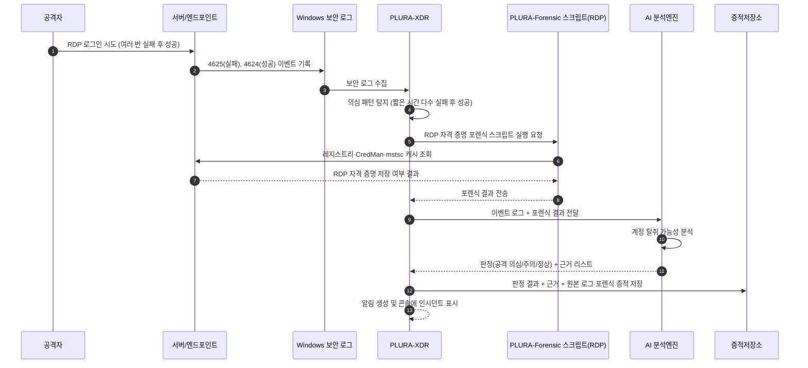

## 예시 1) RDP 자격 증명 저장 여부 + 의심 로그인

**[1] 이벤트 로그에서 탐지**

* Windows Security 4624 (로그온 성공), 4625 (로그온 실패), 4776 (계정 인증 실패)
* 특정 서버에 대해

  * 새 위치(국가/공인 IP)에서 4624 다수 발생
  * 짧은 시간 내 4625 → 4624 패턴(브루트포스/크리덴셜 스터핑 의심)

**[2] 포렌식 항목으로 확인**

* PLURA-Forensic 스크립트:

  * `Check-RDP-Min.ps1` 또는 `Check-RDP-RegistryOnly.ps1`로

    * RDP 자격 증명 저장 흔적 (CredMan, mstsc RDP 캐시 등) 확인
  * `netstat` / Sysmon EID 3으로 RDP 세션 관련 네트워크 연결 확인

**[3] AI로 내용 분석**

* AI 프롬프트 예:

  > “다음 이벤트 로그(4624/4625/4776)와 포렌식 결과(RDP 자격 증명 저장 여부, 최근 RDP 접속 IP)를 종합하여
  > 계정 탈취 가능성을 평가하고, 공격 시나리오(브루트포스, 피싱 후 탈취 등)를 추정해 줘.
  > ‘공격 의심/주의/정상’ 중 하나로 판정하고 근거를 리스트로 설명해 줘.”

**[4] 공격 판단 + 근거 저장**

* 저장 예시:

  * `verdict`: `공격 의심`
  * `reason`:

    * `[1] 짧은 시간 내 다수의 4625(로그온 실패) 후 동일 계정으로 4624(성공) 발생`
    * `[2] 정상 사용 이력 없는 해외 IP에서 로그인 성공`
    * `[3] RDP 비밀번호 저장 정책 미적용(DisablePasswordSaving=0), 크리덴셜 탈취 시 재사용 위험 존재`
   
---

## Sequence Diagram

