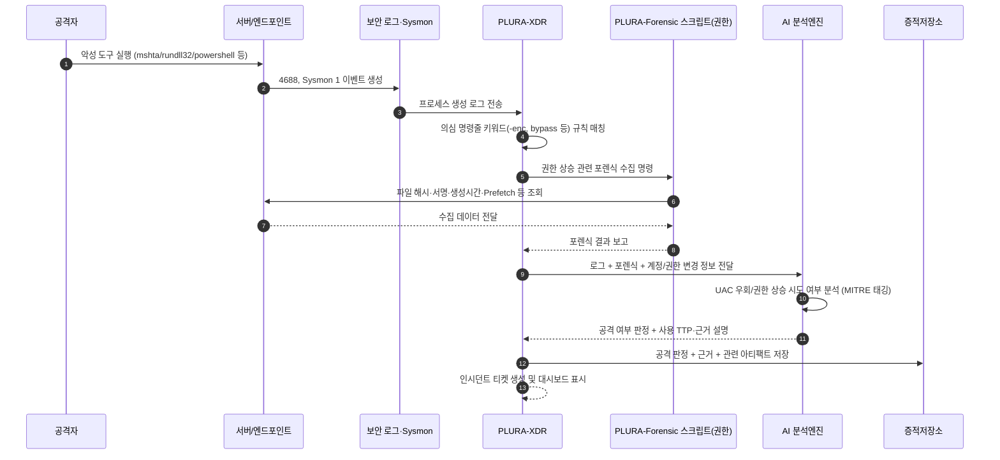

## 예시 2) 관리자 권한 상승 시도 (UAC 우회·권한 상승 도구)

**[1] 이벤트 로그에서 탐지**

* Security 4688 (프로세스 생성), Sysmon EID 1
* 의심 패턴:

  * `powershell.exe`, `cmd.exe`, `mshta.exe`, `rundll32.exe` 등
  * 명령줄에 `-enc`, `bypass`, `Invoke-`, `JuicyPotato`, `PrintSpoofer` 등 UAC 우회/권한 상승 키워드 포함

**[2] 포렌식 항목으로 확인**

* PLURA-Forensic 스크립트:

  * 최근 프로세스 실행 내역 / Prefetch / Shimcache
  * 해당 경로 파일의 해시, 서명 여부, 생성·수정 시간
  * 로컬 관리자 그룹 멤버 추가 여부(Event 4732/4728 등)

**[3] AI로 내용 분석**

* AI 프롬프트 예:

  > “다음 프로세스 생성 로그(4688, Sysmon 1)와 파일 해시·서명 정보, 로컬 관리자 그룹 변경 로그를 분석해서
  > 권한 상승 공격(UAC 우회, 시스템 권한 획득) 여부를 평가해 줘.
  > 사용된 기법을 MITRE ATT&CK 기준으로 태깅하고, 공격 단계(Initial, PrivEsc, DefenseEvasion)도 함께 정리해 줘.”

**[4] 공격 판단 + 근거 저장**

* `verdict`: `권한 상승 공격 강하게 의심`
* `reason`:

  * `[1] 정상 앱 경로가 아닌 Temp 경로에서 mshta.exe + 난독화된 스크립트 실행`
  * `[2] 실행 직후 Administrators 그룹에 특정 계정이 추가된 4732 이벤트 발생`
  * `[3] 파일 서명 정보 없음, 외부에서 다운로드된 흔적 있음(Browser cache/ZoneId)`

---

## Sequence Diagram

