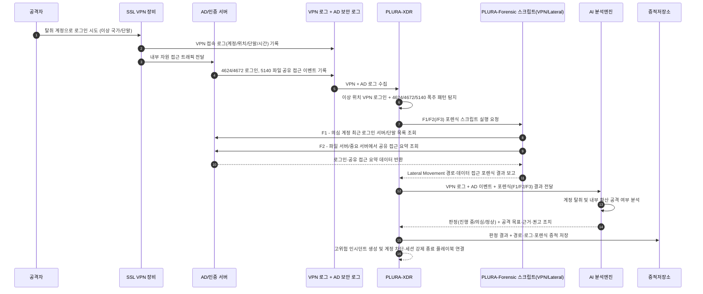

## 예시 5) VPN/SSL VPN 계정 탈취 및 Lateral Movement 시작

*(Trigger: VPN 장비 로그 + Windows 이벤트 ID 조합)*

**[1] 이벤트/장비 로그에서 탐지**

* **SSL VPN 장비 로그**

  * 평소와 다른 **국가/시간대/단말 정보**에서 동일 계정으로 접속
  * 짧은 시간 내 여러 번 로그인 실패 후 성공 (Brute-force/크리덴셜 스터핑 의심)

* **AD/Windows 보안 로그 (핵심 Event ID 조합)**

  * `Event ID 4624` – 로그인 성공

    * 동일 계정이 VPN 로그인 직후 **여러 서버에 LogonType 3(네트워크), 10(RDP)** 로 연쇄 로그인
  * `Event ID 4672` – Special Logon

    * VPN 접속 직후, 평소 사용하지 않던 워크스테이션에서 **특권 계정 로그인** 발생
  * `Event ID 5140` – A network share object was accessed

    * 파일 서버에 대한 대량 공유 접근·열람/복사 시도가 짧은 시간 내 집중

> XDR 상관분석 관점:
> **“이상 위치의 SSL VPN 로그인” + “바로 이어지는 4624/4672/5140 폭주”** 패턴을 트리거로
> 아래 포렌식 스크립트를 호출.

---

**[2] 포렌식 항목으로 확인**
*(이벤트 패턴이 잡히면 자동 호출할 미니 포렌식 2~3개)*

* **[F1] 의심 계정의 최근 로그인 서버·단말 경로 스냅샷**

  * DC에서 해당 계정의 최근 `4624/4672` 이벤트를 기반으로

    * 어떤 서버/단말에, 어떤 로그온 유형(3/10)으로 접근했는지 타임라인 덤프
  * → **Lateral Movement 경로를 한눈에 보기 위한 계정 단위 “최근 로그인 서버 목록”**

* **[F2] 내부 서버 측 접근 흔적 요약 (파일 서버/중요 서버)**

  * 주요 파일 서버·백업 서버에서

    * 의심 계정에 대한 최근 `5140`(공유 접근), 대량 파일 열람/복사 이벤트 요약
  * → “VPN 접속 후 어디서, 어떤 데이터에 손을 댔는지”를 보는 **파일/리소스 접근 포렌식 스냅샷**

* **[F3] (선택) 의심 단말의 VPN 자격 증명 저장 여부**

  * 의심 계정이 주로 사용하던 단말에서:

    * VPN 클라이언트 설정(계정 ID, 서버 주소 등)
    * OS 크리덴셜 저장소(저장된 VPN 비밀번호/토큰 여부)
  * → **단말 탈취 vs 순수 계정 탈취** 구분에 도움

---

**[3] AI로 내용 분석**

* AI 프롬프트 예:

  > “다음 SSL VPN 접속 로그와 AD 보안 이벤트(4624, 4672, 5140),
  > 그리고 포렌식 결과(F1: 계정별 최근 로그인 서버 목록,
  > F2: 파일 서버/중요 서버 접근 요약, F3(있다면): VPN 자격 증명 저장 여부)를 시간 순으로 정리해서
  >
  > 1. 계정 탈취 후 내부 확산(Lateral Movement) 패턴인지 평가해 줘.
  > 2. 공격자가 노린 주요 자원(파일 서버, 백업 서버, DC 등)을 추정해 줘.
  > 3. ‘계정 탈취 공격 진행 중 / 계정 탈취 의심 / 정상 사용’ 중 하나로 판정해 줘.
  > 4. 판정 근거를 리스트로 정리하고, 즉시 취할 조치(계정 잠금, 세션 강제 종료, 영향 서버 추가 포렌식 범위)를 제안해 줘.”

---

**[4] 공격 판단 + 근거 저장**

* `verdict`: `계정 탈취 후 내부 확산 공격 진행 중`

* `reason`:

  * `[1] 평소 사용 지역과 다른 해외 IP에서 SSL VPN 접속이 발생했고, 직후 동일 계정으로 여러 서버에 4624/4672 이벤트가 연쇄적으로 기록됨`
  * `[2] F1 포렌식 기준, 짧은 시간 안에 평소 접속 이력이 없던 파일 서버·백업 서버 등으로 로그인 경로가 급격히 확장됨`
  * `[3] F2 포렌식 기준, 특정 파일 서버에서 해당 계정으로 대량 파일 열람·복사 이벤트(5140)가 집중 발생함`

---

## Sequence Diagram

