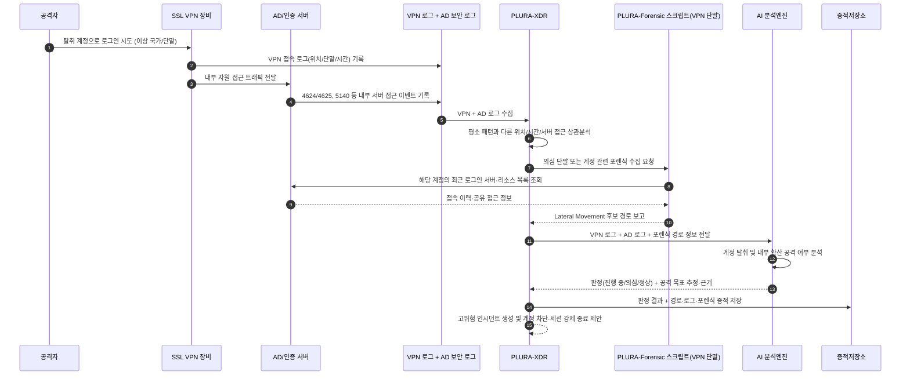

## 예시 5) VPN/SSL VPN 계정 탈취 및 Lateral Movement 시작

**[1] 이벤트/장비 로그에서 탐지**

* SSL VPN 로그:

  * 평소와 다른 국가/시간대/단말 정보로 접속
* AD 보안 로그:

  * 로그인 후 곧바로 여러 서버에 대한 4624/4625, 5140(공유 접근) 등 발생

**[2] 포렌식 항목으로 확인**

* VPN 게이트웨이/클라이언트 설정 파일, 저장된 자격 증명 여부
* 접속 단말의 브라우저 쿠키/캐시, OTP 백업 여부
* 내부 서버에서의 접속 흔적(최근 RDP/MSTSC 목록, SMB 접속 이력)

**[3] AI로 내용 분석**

* AI 프롬프트 예:

  > “다음 VPN 접속 로그와 AD 로그인 이벤트, 내부 서버 접근 로그를 시간 순으로 정리해서
  > 계정 탈취 후 내부 확산(Lateral Movement) 패턴인지 분석해 줘.
  > 공격자의 목표(파일 서버 접근, 백업 서버 접근 등)를 추정하고,
  > ‘계정 탈취 공격 진행 중/의심/정상’으로 판정해 줘.”

**[4] 공격 판단 + 근거 저장**

* `verdict`: `계정 탈취 후 내부 확산 공격 진행 중`
* `reason`:

  * `[1] 평소 사용 지역과 다른 해외 IP에서 SSL VPN 접속`
  * `[2] 로그인 직후 다수 서버에 대한 SMB/RDP 로그인 시도(성공/실패 혼재)`
  * `[3] 특정 파일 서버에서 대량 파일 열람·복사 이벤트 집중 발생`

---

## Sequence Diagram

