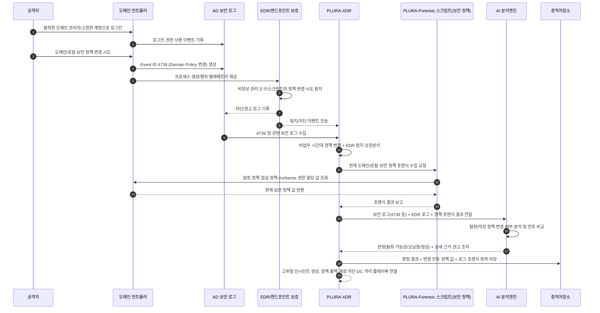

## 예시 6) 도메인 관리자 계정 탈취 또는 도메인 정책 변경 탐지 (Event ID 4739)

**[1] 이벤트/장비 로그에서 탐지**

* **AD 보안 로그(Security)**

  * `Event ID 4739 – A Domain Policy was changed`
  * 비업무 시간대에 **도메인 정책(암호/계정 잠금/케르beros 등)** 값이 갑자기 변경
  * 변경 주체 계정이 평소 도메인 정책을 변경하지 않던 계정이거나,
    최근 의심 로그인 이력이 있는 계정

* **EDR 로그(도메인 컨트롤러 보호 필터)**

  * 도메인 컨트롤러에서 `powershell.exe`, `ntdsutil.exe`, `ldifde.exe` 등
    **정상 관리 콘솔이 아닌 툴**을 통해 디렉터리/정책 변경 시도 탐지
  * 정책 변경 관련 동작이 **EDR 차단 필터**에 의해 차단 또는 경고로 기록

    * 예: “비신뢰 프로세스에 의한 AD 객체 수정 시도 차단”,
      “도메인 컨트롤러에서 미승인 PowerShell 스크립트 실행 차단”

---

**[2] 포렌식 항목으로 확인**

* **도메인/로컬 보안 정책 현재 값 조회 (포렌식 스크립트)**

  * 도메인 컨트롤러에서 다음 항목 현재값 덤프:

    * 도메인 암호 정책(최소 길이, 복잡성 요구, 만료 기간 등)
    * 계정 잠금 정책(잠금 임계값, 잠금 기간, 관찰 기간)
    * Kerberos 정책(TGT 수명, 재발급 제한 등)
  * 로컬 보안 정책(SeDebugPrivilege, SeRemoteInteractiveLogonRight 등)
    사용자 권한 할당과 보안 옵션(Security Options) 목록

* **변경 전·후 비교(가능 시)**

  * 베이스라인(기준 값) 또는 직전 백업 값과 비교해

    * 비밀번호 정책 완화(길이↓, 만료기간↑)
    * 잠금 임계값 증가 또는 잠금 기능 사실상 무력화
    * 관리자 그룹/권한에 특정 계정 추가 여부
  * 변경 주체 계정의 최근 로그인 이력, 사용 위치, 사용 호스트도 함께 확인

---

**[3] AI로 내용 분석**

* AI 프롬프트 예:

  > “다음 AD 보안 로그(Event ID 4739 등)와 EDR 차단 로그,
  > 그리고 현재 도메인/로컬 보안 정책 포렌식 결과(암호/잠금/Kerberos/권한 할당)를
  > ‘변경 전-후’ 관점에서 비교해 줘.
  >
  > 1. 정책 변경이 **도메인 관리자 계정 탈취** 또는 **권한 상승 후 백도어 설정**에 해당하는지 평가해 줘.
  > 2. 공격자가 노리는 효과(비밀번호 추측 용이, 계정 잠금 회피, 장기 체류 등)를 추정해 줘.
  > 3. ‘도메인 관리자 계정 탈취 가능성 높음 / 정책 오남용 의심 / 정당한 변경’ 중 하나로 판정해 줘.
  > 4. 판정 근거를 리스트로 정리하고, 즉시 수행해야 할 대응 조치(롤백, 계정 잠금, 감시 강화 등)를 제안해 줘.”

---

**[4] 공격 판단 + 근거 저장**

* `verdict`: `도메인 관리자 계정 탈취 또는 정책 악성 변경 강하게 의심`

* `reason`:

  * `[1] Event ID 4739이 비업무 시간대에 발생했고, 변경 계정이 평소 도메인 정책을 변경하지 않던 계정임`
  * `[2] EDR 차단 필터가 도메인 컨트롤러에서 비정상 PowerShell/ntdsutil 실행과 AD 정책 변경 시도를 탐지·차단함`
  * `[3] 암호/잠금 정책이 짧은 시간 내 대폭 완화되어, 무차별 대입·크리덴셜 스터핑·장기 체류에 유리한 방향으로 변경됨`
  * `[4] 변경 직전에 해당 계정으로 의심스러운 로그인(새 IP, 새 단말, 실패 후 성공 패턴)이 존재함`

---

## Sequence Diagram

