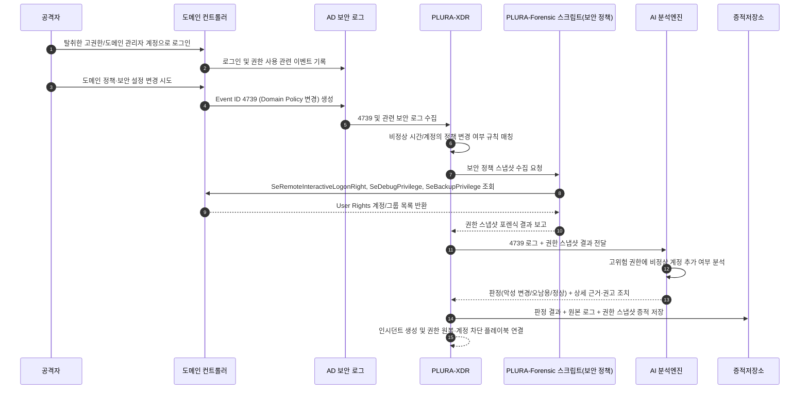

## 예시 6) 도메인 정책 변경을 통한 도메인 관리자 계정 탈취/보안 약화 의심

*(Trigger: `Event ID 4739 – A Domain Policy was changed`)*

**[1] 이벤트 로그에서 탐지**

* Security 4739 (A Domain Policy was changed)

  * 도메인의 **암호 정책 / 계정 잠금 정책 / Kerberos 정책** 등이 변경될 때 발생
  * 비업무 시간대, 또는 평소 정책을 변경하지 않던 계정이 변경 주체로 등장할 경우 의심
* (선택) 관련 보조 이벤트:

  * 4720/4728/4732 등: 신규 계정 생성, 그룹(특히 Domain Admins/Administrators) 추가가 **근접 시간대**에 함께 발생하는지 확인

---

**[2] 포렌식 항목으로 확인**

* PLURA-Forensic 스크립트: **로컬/도메인 보안 정책 스냅샷(핵심 3종)**

  * **SeRemoteInteractiveLogonRight**

    * *Allow log on through Remote Desktop Services*
    * 도메인 컨트롤러/중요 서버에 **RDP로 직접 접근 가능한 계정/그룹 목록** 덤프
  * **SeDebugPrivilege**

    * *Debug programs*
    * 디버그 권한을 가진 계정/그룹 목록 덤프
    * Domain Admin이 아닌 서비스/일반 계정이 포함돼 있는지 확인
  * **SeBackupPrivilege**

    * *Back up files and directories*
    * 백업 권한 보유 계정/그룹 덤프
    * AD DB/시스템 파일 덤프에 활용 가능한 권한이므로, 비정상 계정 존재 여부 확인

> 포인트: 4739 발생 시점의 **“권한 할당(User Rights)” 최소 3종 스냅샷**을 남겨
> 나중에 “누가 언제 RDP/Debug/Backup 권한을 가지게 되었는가”를 정확히 재구성할 수 있게 함.

---

**[3] AI로 내용 분석**

* AI 프롬프트 예:

  > “다음 AD 보안 로그(Event ID 4739 등)와
  > 포렌식으로 수집한 User Rights 스냅샷(SeRemoteInteractiveLogonRight, SeDebugPrivilege, SeBackupPrivilege)을 분석해서
  >
  > 1. 도메인 정책 변경이 도메인 관리자 계정 탈취나 장기 체류를 위한 보안 약화에 해당하는지 평가해 줘.
  > 2. 원래 이 권한을 가지지 않았어야 할 계정/그룹이 새로 추가되었는지 중심으로 봐 줘.
  > 3. ‘도메인 정책 악성 변경 강하게 의심 / 정책 오남용 의심 / 정당한 변경’ 중 하나로 판정해 줘.
  > 4. 판정 근거를 리스트로 정리하고, 즉시 수행해야 할 대응 조치(권한 원복, 계정 잠금, 추가 포렌식 범위 확장)를 제안해 줘.”

---

**[4] 공격 판단 + 근거 저장**

* `verdict`: `도메인 정책 악성 변경 또는 고위험 권한 부여 강하게 의심`

* `reason`:

  * `[1] Event ID 4739이 비업무 시간대에 발생했고, 평소 도메인 정책 변경을 수행하지 않던 계정이 변경 주체로 기록됨`
  * `[2] SeRemoteInteractiveLogonRight에 기존에 없던 계정/그룹(Domain Users, 특정 서비스 계정 등)이 새로 포함되어 DC/중요 서버에 RDP 접근 가능해짐`
  * `[3] SeDebugPrivilege 또는 SeBackupPrivilege에 비정상 계정이 추가되어, 프로세스 메모리/AD DB 덤프 등 권한 상승·자격 증명 탈취 가능성이 높아짐`

---

## Sequence Diagram

