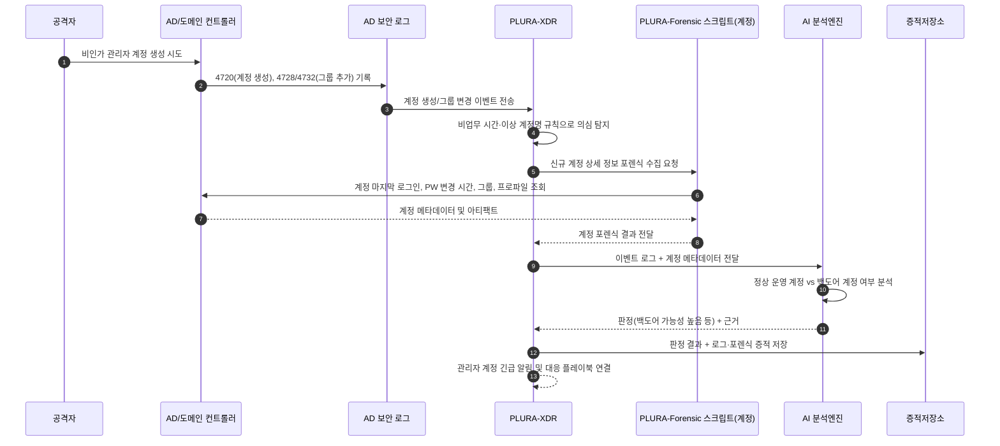

## 예시 3) 신규 관리자 계정 생성 및 원격 로그인

**[1] 이벤트 로그에서 탐지**

* Security 4720 (사용자 계정 생성), 4728/4732 (그룹 멤버 추가), 4624 (로그온 성공)
* 패턴:

  * 심야 시간대에 알 수 없는 계정 ID 생성
  * 생성 직후 RDP/SMB 로그온 시도(4624 LogonType 10, 3)

**[2] 포렌식 항목으로 확인**

* 로컬/도메인 사용자 계정 목록 덤프
* 해당 계정의:

  * 마지막 로그인 시간, 비밀번호 변경 시간
  * 홈 디렉터리/프로파일 경로에 남은 흔적(최근 사용 프로그램, Run 키 등)

**[3] AI로 내용 분석**

* AI 프롬프트 예:

  > “다음 계정 생성 이벤트(4720, 4728/4732)와 해당 계정의 로그인 로그(4624),
  > 계정 프로파일 내 포렌식 아티팩트를 종합하여,
  > 이 계정이 정상 운영용인지, 침해자가 만든 백도어 계정인지 판단해 줘.
  > ‘정상/의심/백도어 가능성 높음’으로 판정하고, 권고 대응 조치도 함께 제시해 줘.”

**[4] 공격 판단 + 근거 저장**

* `verdict`: `백도어 계정 가능성 높음`
* `reason`:

  * `[1] 인사·운영 정책에 없는 계정명이 비업무 시간에 생성`
  * `[2] 계정 생성 후 수 분 내 외부 IP에서 RDP 로그온(Success) 발생`
  * `[3] 해당 계정으로 생성된 파일·실행 흔적이 거의 없음(운영 계정으로 보기 어려움)`

## Sequence Diagram

