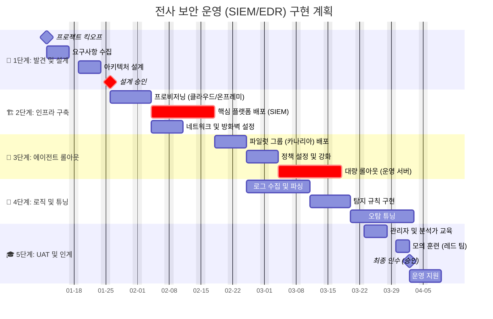

```mermaid
gantt
    title 전사 보안 운영 (SIEM/EDR) 구현 계획
    dateFormat  YYYY-MM-DD
    axisFormat  %m-%d
    excludes    weekends

    %% ==========================================
    %% 1단계: 착수
    %% ==========================================
    section 🚀 1단계: 발견 및 설계
    프로젝트 킥오프              :milestone, m1, 2026-01-12, 0d
    요구사항 수집                :a1, 2026-01-12, 5d
    아키텍처 설계                :a2, after a1, 5d
    설계 승인                    :crit, milestone, m2, after a2, 0d

    %% ==========================================
    %% 2단계: 기반
    %% ==========================================
    section 🏗️ 2단계: 인프라 구축
    프로비저닝 (클라우드/온프레미) :b1, after a2, 7d
    핵심 플랫폼 배포 (SIEM)       :crit, b2, after b1, 10d
    네트워크 및 방화벽 설정       :b3, after b1, 5d

    %% ==========================================
    %% 3단계: 배포
    %% ==========================================
    section 📡 3단계: 에이전트 롤아웃
    파일럿 그룹 (카나리아) 배포   :c1, after b2, 5d
    정책 설정 및 강화             :c2, after c1, 5d
    대량 롤아웃 (운영 서버)       :crit, c3, after c2, 10d

    %% ==========================================
    %% 4단계: 최적화
    %% ==========================================
    section 🧠 4단계: 로직 및 튜닝
    로그 수집 및 파싱             :d1, after c1, 10d
    탐지 규칙 구현                :d2, after d1, 7d
    오탐 튜닝                     :d3, after d2, 10d

    %% ==========================================
    %% 5단계: 인계
    %% ==========================================
    section 🎓 5단계: UAT 및 인계
    관리자 및 분석가 교육         :e1, 2026-03-23, 5d
    모의 훈련 (레드 팀)           :e2, after e1, 3d
    최종 인수 (승인)              :milestone, m3, after e2, 0d
    운영 지원                     :e3, after m3, 5d
```
